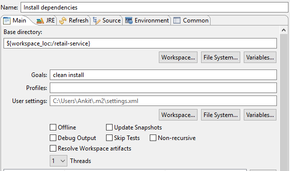
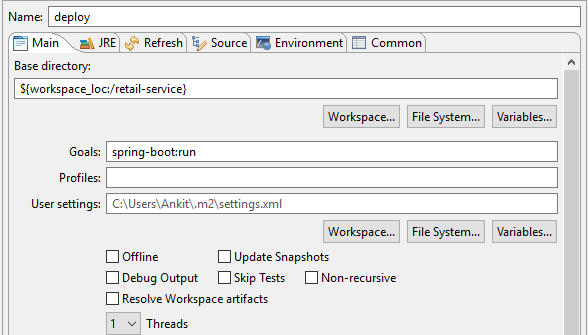

# Retail Service

This project uses the below tech stack for the implementation:

- Spring boot - to create a deployable micro-service which has an embedded tomcat server.
- Apache Maven - build tool which provides enhanced dependency management.
- Swagger - to display and test all the exposed APIs.
- MongoDB - using a noSQL database to store data.
- Eclipse Neon - IDE used to develop the service.

## Running the project

After taking the project checkout, please do the following steps:

1. Maven install - Create and run a maven run configuration as in the screenshot below:

2. Deploying the app - Create and run a maven configuration as in the screenshot below:

This step will deploy the app in the embedded tomcat container [here](http://localhost:8080/).
To test successful deploy, please open the [Swagger link](http://localhost:8080/swagger-ui.html)